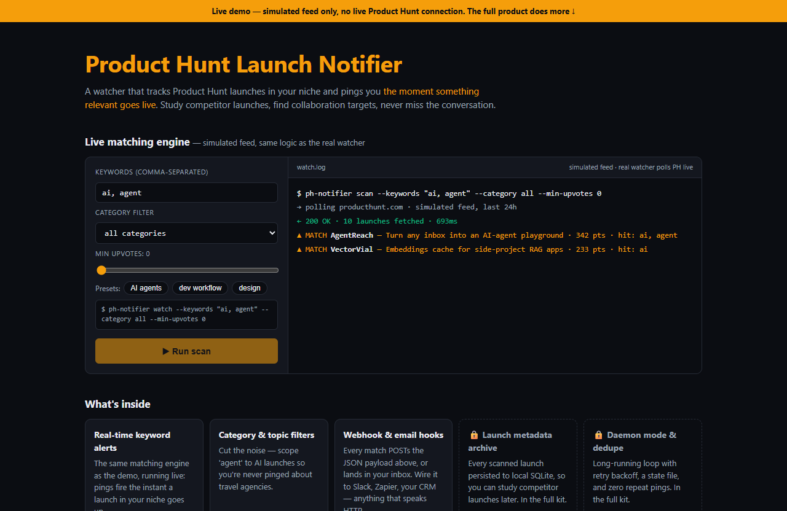

# Product Hunt Launch Notifier — live demo

  

  <a href="https://amos-mig.github.io/product-hunt-notifier-demo/"><strong>▶ Open the live demo</strong></a> ·
  <a href="https://amosmign.gumroad.com/l/product-hunt-notifier"><strong>Get the full product · €29</strong></a>

## What this is

An in-browser simulation of the Product Hunt Launch Notifier's matching engine: set keywords, a category filter and an upvote floor, then run a scan against a canned 24h launch feed. Matched launches print as alerts and fire a realistic webhook POST with JSON payload, status codes and latency.

**Try it:** Type keywords like 'ai, agent' or 'ui, figma' (or click a preset), drag the upvote floor, and hit Run scan to see which simulated launches match and exactly what the webhook would deliver.

## What you get in the full product

- Real-time alerts on launches matching your keywords
- Category and topic filters to cut the noise
- Webhook/email notification hooks included
- Launch metadata captured for later analysis
- Single Python file, free-tier friendly

## About

- **Storefront:** [kits.amosmignery.dev](https://kits.amosmignery.dev) — single-file products, instant download, commercial license
- **Checkout:** [Gumroad](https://amosmign.gumroad.com/l/product-hunt-notifier) (Merchant of Record, VAT handled)
- **Full product:** [Product Hunt Launch Notifier](https://amosmign.gumroad.com/l/product-hunt-notifier) · €29

## License

The demo page in this repo is MIT-licensed — reuse the technique, not the product.
The **Product Hunt Launch Notifier** itself is not included here and is not free software.
